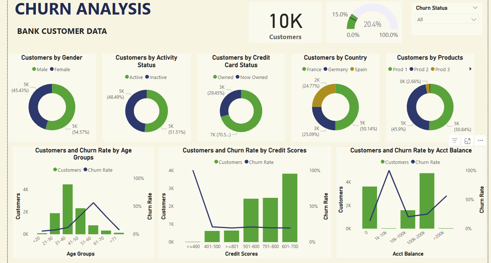

# Customer-Churn-Analysis-with-Power-BI

# Problem Statement:
This project focuses on analyzing customer churn for Deutsche Bank, one of Germany’s largest and most prominent financial institutions. Customer churn represents the rate at which clients discontinue their relationship with the bank. By examining churn rates against various demographic, transactional, and behavioral factors, the analysis aims to identify the key drivers of customer attrition. The insights generated will enable Deutsche Bank’s business teams to develop targeted strategies and make data-driven decisions to reduce churn and enhance customer retention.
